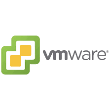

<!-- PROJECT SHIELD -->
[![Contributors][contributors-shield]][contributors-url]
[![Forks][forks-shield]][forks-url]
[![Stargazers][stars-shield]][stars-url]
[![Issues][issues-shield]][issues-url]
[![MIT License][license-shield]][license-url]
[![LinkedIn][linkedin-shield]][linkedin-url]


<!-- PROJECT LOGO -->
<br />
<p align="center">
  <a href="https://github.com/shinau21/vmware-esxi">
    
  </a>

  <h3 align="center">VMWARE ESXI 6.7.1</h3>

  <p align="center">
    This is public project to fix problem "No Network Adapters" when installation VMWARE ESXI 6.7
    <br />
    <a href="https://github.com/shinau21/vmware-esxi"><strong>Explore the docs »</strong></a>
    <br />
    <br />
    <a href="https://github.com/shinau21/vmware-esxi">View</a>
    ·
    <a href="https://github.com/shinau21/vmware-esxi/issues">Report Bug</a>
    ·
  </p>
</p>


<!-- TABLE OF CONTENTS -->
## Table of Contents

* [About the Project](#about-the-project)
* [Getting Started](#getting-started)
  * [Requirements](#requirements)
  * [Installation](#installation)
  * [Tutorial](#tutorial)
* [Contributing](#contributing)
* [License](#license)
* [Contact](#contact)
* [Acknowledgements](#acknowledgements)


<!-- ABOUT THE PROJECT -->
## About The Project

[![Product Name Screen Shot][product-screenshot]](https://my.vmware.com/web/vmware/downloads/details?productId=742&downloadGroup=ESXI67U1)

!! Note !!</br>
This program tested on Windows 10 and working on it.

What can you get:
* Provides convenience when installing vmware esxi 6.7
* You can fork this project to your own github :smile:


<!-- GETTING STARTED -->
## Getting Started

This is an example of how you may give instructions on setting up your project locally.
To get a local copy up and running follow these simple example steps.

### Requirements
This is a reference that you can use to find out about making a custom vmware esxi program.
* [PowerShell](https://docs.microsoft.com/en-us/powershell/)
* [PowerCLI](https://drive.google.com/file/d/1AWagIHfj9bYJFWYnmyzxaVBZVfwUDvEd/view?usp=sharing)
* [Driver LAN](https://drive.google.com/file/d/14jtAmx5XbpZPDULTN2_3P5uRZhHeFx4H/view?usp=sharing)
* [VMWARE ESXI](https://drive.google.com/file/d/1jo4EM2MuohzAbloQNnZUptQ7PtdIpeq3/view?usp=sharing)

Install all requirements above.

### Installation

1. Clone the repo
```bat
git clone https://github.com/shinau21/vmware-esxi.git
```
2. Run powershell as administrator.
```powershell
Set-ExecutionPolicy -ExecutionPolicy RemoteSigned
```
3. Install & Open VMware PowerCLI
Then install VMware PowerCLI and Open with administrator

4. After opened PowerCLI, change your directory into Costumize folder, then running the vmware.ps1
```powershell
.\vmware.ps1
```

## Tutorial
<p align="center"><iframe src="assets/vid/tutorial-customize.mp4" height="100%"></iframe>

<!-- ROADMAP -->
## Roadmap

See the [open issues](https://github.com/shinau21/vmware-esxi/issues) for a list of proposed features (and known issues).


<!-- CONTRIBUTING -->
## Contributing

Contributions are what make the open source community such an amazing place to be learn, inspire, and create. Any contributions you make are **greatly appreciated**.

1. Fork the Project
2. Create your master Branch (`git checkout -b master/vmware_esxi`)
3. Commit your Changes (`git commit -m 'Add some Code'`)
4. Push to the Branch (`git push origin master/vmware_esxi`)
5. Open a Pull Request


<!-- LICENSE -->
## License

Distributed under the GNU Lesser General Public License. See `LICENSE` for more information.


<!-- CONTACT -->
## Contact

Rafli Setiawan - shinau21.business@gmail.com


<!-- ACKNOWLEDGEMENTS -->
## Acknowledgements
* [VMWARE](https://www.vmware.com)
* [MICROSOFT WINDOWS](https://www.microsoft.com/en-us/windows)
* [GITHUB](https://github.com)
* [Participant](https://github.com/shinau21/vmware-esxi)


<!-- MARKDOWN LINKS & IMAGES -->
<!-- https://www.markdownguide.org/basic-syntax/#reference-style-links -->
[contributors-shield]: https://img.shields.io/github/contributors/shinau21/vmware-esxi.svg?style=flat-square
[contributors-url]: https://github.com/shinau21/vmware-esxi/graphs/contributors
[forks-shield]: https://img.shields.io/github/forks/shinau21/vmware-esxi.svg?style=flat-square
[forks-url]: https://github.com/shinau21/vmware-esxi/network/members
[stars-shield]: https://img.shields.io/github/stars/shinau21/vmware-esxi.svg?style=flat-square
[stars-url]: https://github.com/shinau21/vmware-esxi/stargazers
[issues-shield]: https://img.shields.io/github/issues/shinau21/vmware-esxi.svg?style=flat-square
[issues-url]: https://github.com/shinau21/vmware-esxi/issues
[license-shield]: https://img.shields.io/github/license/shinau21/vmware-esxi.svg?style=flat-square
[license-url]: https://github.com/shinau21/vmware-esxi/blob/master/LICENSE.txt
[linkedin-shield]: https://img.shields.io/badge/-LinkedIn-black.svg?style=flat-square&logo=linkedin&colorB=555
[linkedin-url]: https://www.linkedin.com/in/rafli-setiawan/
[product-screenshot]: assets/img/logo.png